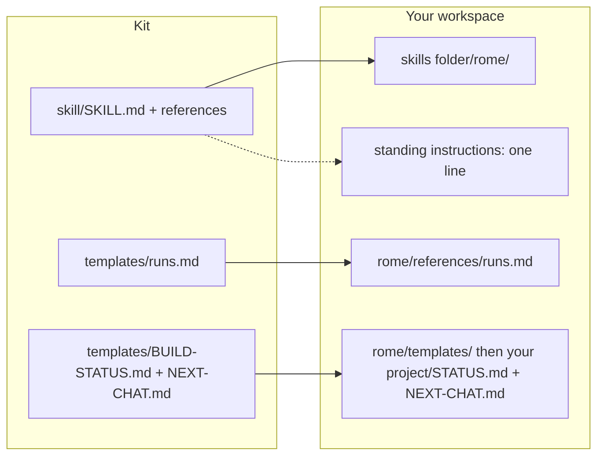

# Rome: an implementation kit

This installs **Rome**, a build protocol for working with an AI assistant: eight steps, each ending at your gate, with your own words as the spec, so the AI builds what you asked and not what it guessed. Takes about 20 to 30 minutes to install, then 45 to 90 minutes for your first real build through all eight steps (author's estimate, not yet cold-tested). You end up with the protocol installed where your AI finds it, one line in your standing instructions so "let's build X" starts it, and one small real thing built and shipped under it.

## Where it lands

| From the kit | Lands at | Decided by |
|---|---|---|
| `skill/` (SKILL.md + two references) | Your AI's skills folder (auto-discovering platforms) or `<workspace>/_tools/rome/` | DP-6 |
| `templates/runs.md` | `<skill install path>/references/runs.md`, empty | DP-4 |
| `templates/BUILD-STATUS.md`, `templates/NEXT-CHAT.md` | `<skill install path>/templates/`, then copied per build into that build's folder, under your own project convention or `<workspace>/builds/` | DP-1 |
| Four short agent definitions (written by the installer, not shipped) | Your platform's agents folder | DP-3, only on platforms with sub-agents |
| one line, not a file | Your standing-instructions file (`CLAUDE.md` / `AGENTS.md` / rules file) | Phase 2 step 5 |
| Your first real build | Its own folder or your existing project's STATUS | Phase 3 |

No new root folder unless you have none; your AI confirms each destination with you before writing.

## How to use it: three on-ramps

1. **You have a coding agent** (Claude Code, Cursor, Codex, Copilot Workspace, Amp, Claude Desktop with file access…): open this repo with it and say **"Read IMPLEMENT.md and walk me through it."** It scans your setup, presents six decisions, installs the protocol, and runs one small real build with you.
2. **You have a chat-only AI:** paste `IMPLEMENT.md` into the chat, follow along, create the files yourself, and keep `STATUS.md` as a note you paste back each session. The protocol is unchanged; the "fresh eyes" checks become a second chat window.
3. **No AI at all:** read `skill/SKILL.md` yourself. The eight steps work as a checklist for any build, with a person in the AI's seat.

**Model recommendation:** run the install, and every step 1, 3, 5 and 7 of every build after it, on the most capable model you have at high reasoning effort. Steps 5 and 7 are where a weaker model agrees with the plan instead of breaking it. Drafting at step 6 can go to a mid-cost model.

## How it works

You start with a dump: what you want, in your words, as messy as you like. The AI organizes it without adding to it, fills six settings (how big, what ships, technical or knowledge), asks you a short numbered batch of questions it would otherwise have answered alone, and lists what it wants to research beyond what you named. That is step 1, and it ends where every step ends: one line, "Step 1 of 8, Rough Define: … Approve?", and it waits for your word. An answered list of questions is never the approval.

Step 2 looks for what already exists, inside your workspace and outside it, per mechanic rather than per idea (the search is "frontmatter parser", not "skill builder"), and comes back with a lean, what argued against it, and suggested additions you rule on by number. Step 3 locks the goal in one to three sentences and writes a definition of done where every line can be proved by output, plus two to five real test cases. Step 4 is the plan: tasks, owners, what each produces.

Step 5 is where Rome differs from a prompt. A reviewer who did not write the plan is told to assume it is wrong and return killer issues only. Findings reach you in two buckets: *Needs you* (situation, recommendation, why) and *Fixed* (no-brainers already applied, you can veto). Step 6 builds, on a copy when it touches anything live. Step 7 repeats the fresh-eyes move on the result: for each done line, the actual output that proves it; "it works" is not evidence. Step 8 ships: the thing lands in its home, every install over a live file is one numbered ask with its diff, a hand-off file is written if the build continues, and a close line asks how deep the feedback loop should go.

Behind every gate, eight tripwires run silently (am I stating as decided something you only implied? is this your quote or my paraphrase? did I read the reviewer's own output, not a relay?) and only the ones that fire get printed. Long builds retire the chat on purpose before it degrades, and re-enter from the hand-off file. The protocol is sized by tier: a tier-1 tweak runs all eight steps in a few lines each and leaves no files behind; a tier-3 build gets a folder and several chats.

## What's in here

| Path | What it is |
|---|---|
| `IMPLEMENT.md` | The installer script, written to your AI (humans can follow it too) |
| `EXAMPLE-BUILD.md` | One small build through all eight steps, plus how other build types map |
| `STATUS.md` | Install progress: scan results, decisions, phase ticks; the resume spine |
| `AGENTS.md` / `CLAUDE.md` | Entry instructions for coding agents that auto-read those files |
| `skill/SKILL.md` | The protocol itself, in portable agent-skill format |
| `skill/references/prompts.md` | Every prompt Rome fires: red-team brief, plan review, evidence check, build review, findings format |
| `skill/references/research.md` | The research brief template, the three tiers, the two sweeps, how borrowed work is graded |
| `templates/` | A build STATUS, a hand-off file, a runs log; `templates/README.md` maps each to the decision that gates it |

## What you end up with

- The **protocol** installed where your AI finds it (or kept as documents you paste, on chat-only).
- A **reviewer setup** for steps 5 and 7: a second model, a fresh agent, or a fresh chat, chosen to fit your platform.
- A **runs log** so the protocol gets better with each build instead of staying theory.
- A line in your AI's **standing instructions** so "let's build X" just works.
- **One real build**, small, shipped under the protocol, with its paper in a place a fresh session can resume from.
